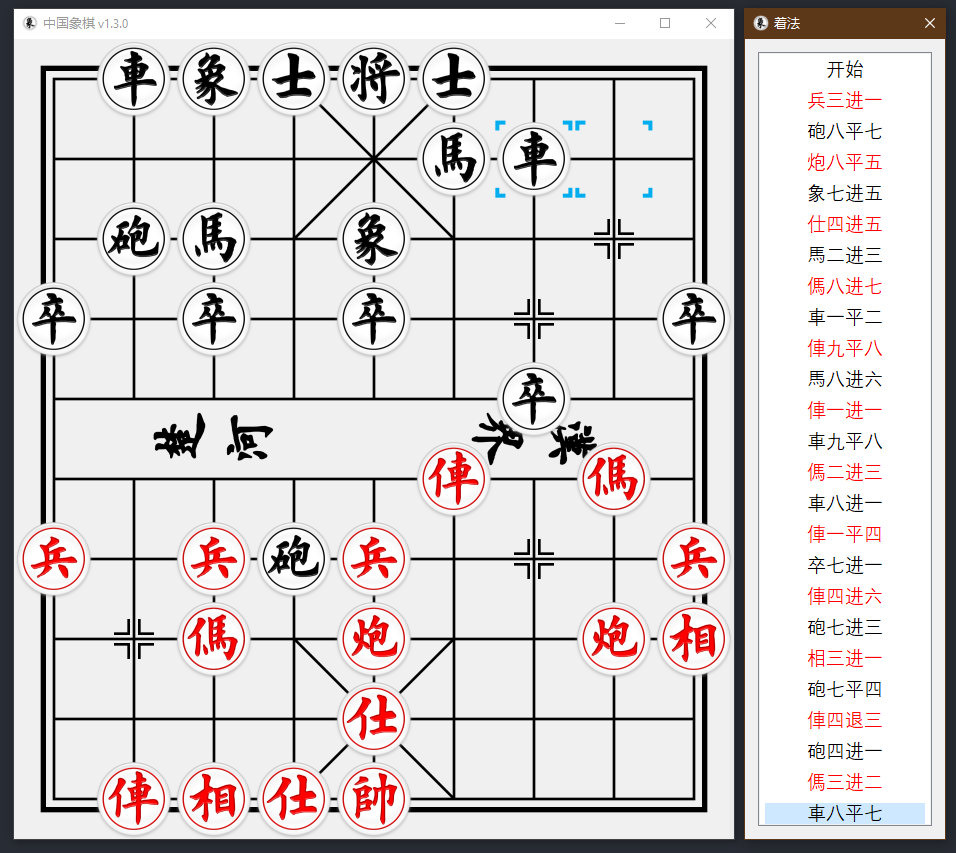

# 中国象棋

一个中国象棋的程序

## 修改日志

- [2021-06-27] v1.6.2
    - 棋谱：支持载入中文棋谱
    - 棋谱：支持直接打开文件
    - 棋谱：支持直接粘贴字符串
    - 着法：添加半回合序号
    - 着法：显示标准着法的设置
- [2021-06-25] v1.5.0
    - 布局：添加布局功能，可随时调整棋盘状态
    - 修复了一些 Bug
- [2021-06-23] v1.4.0
    - 界面：添加 Toast 提示
    - 修复了一些 Bug
- [2021-06-21] v1.3.0
    - 着法：添加着法对话框  
    - 设置：添加提示深度和引擎深度
    - 界面：更新棋子样式
- [2021-06-19] v1.2.0
    - 设置：持久化
    - 设置：添加音效开关
    - 设置：引擎延迟（单位：毫秒）
- [2021-05-30] v1.1.0 - 添加设置
    - 设置：窗口透明度，虽然没什么用，但是也挺有趣的
    - 设置：反转棋盘
    - 设置：红方 - 棋手/电脑
    - 设置：黑方 - 电脑/棋手
    - 设置：检查更新
- [2021-05-23] v1.0.0
    - 第一版发布
